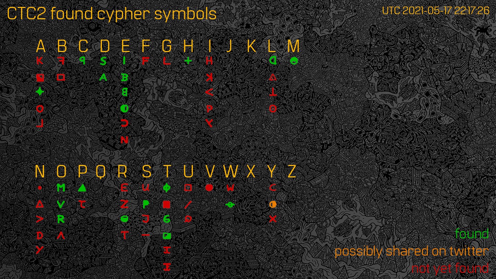

# symbol-status

This repo shows the current status of the symbols found for the dbrand Complete the Code 2 challenge.

[Join the madness and crack the code](https://discord.gg/dbrand)

## Current status
### Known characters: `CEEDDORTT`

(credit @albedo)

(credit @GlitterButts)

## What is this?

On April 1, 2021, dbrand started selling face masks. You were able to add a "Surprise gift" to your purchase for some extra cash, with no hint as to what it was.

Once the face masks started getting delivered after they shipped on April 12, 2021, the "Surprise gift" turned out to be a card like the following:

(credit [@SpaceWolfPlays](https://twitter.com/spacewolfplays))

The front of the card translates to `POSTANDFINDONTWITTER` if decrypted with the Zodiac Z340 cipher, which was cracked in December of 2020 (see [here](http://zodiackillersite.com/viewtopic.php?f=23&t=5079) for more information).

Since then, a bunch of dipshits on Discord have been trying to figure out what exactly the backs of the cards are supposed to mean.

## Solve status

Currently unsolved. Awaiting more symbols
