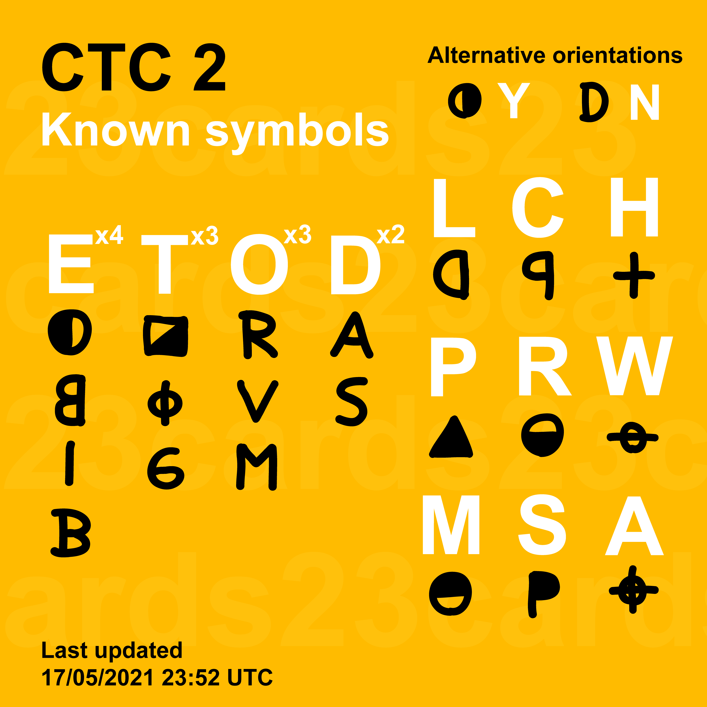
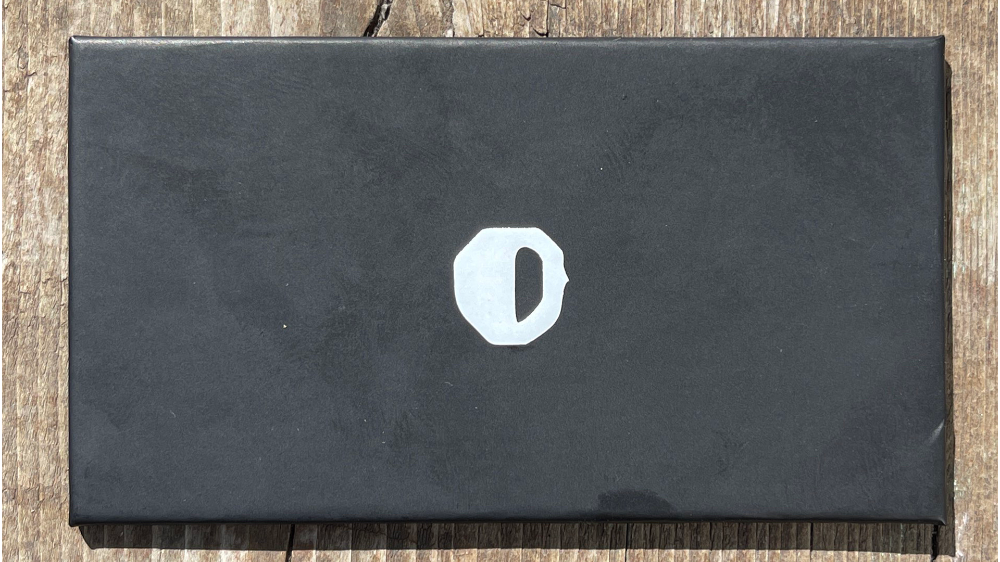

# symbol-status

This repo shows the current status of the symbols found for the dbrand Complete the Code 2 challenge.

[Join the madness and complete the code](https://discord.gg/dbrand)

## Current solve status
Still currently unsolved. 

As of April 30, 2021, 069 has "confirmed" that we are still missing letters. You can see the message with the reaction [here](https://discord.com/channels/520021794380447745/832309320934621234/837808784562716763) (If you're in the Discord), or below.

### Known characters: `ACDDEEEHOOORSTTTW`

(credit [@albedo/tooboredtocode](https://github.com/tooboredtocode))

(credit [@GlitterButts](https://github.com/glitterbutts))

## What is this?

On April 1, 2021, dbrand started selling face masks again. You were able to add a "Surprise" to your purchase for an extra 10 USD, which turned out to be a robot camo mask.

Once the face masks started getting delivered after they shipped on April 12, 2021, the robot camo mask also included a card like the following:

| Back  | Front |
| --- | --- |
|  |  |

Using the Zodiac Z340 Cipher the back text decrypts to `POSTANDSEARCHONTWITTER`. This is the same on every card.
On the front of the card there is a singular Zodiac Killer Symbol. These can vary and we are looking for such symbols!

We have a bunch of dipshits on Discord that have been trying to figure out what exactly the backs of the cards are supposed to mean.

If you have a symbol please post the image in the [Discord](https://discord.gg/dbrand) or [Subreddit](https://www.reddit.com/r/dbrand)!, additionally you can post it on Twitter using [#CTC2](https://twitter.com/hashtag/CTC2).

More infomation on the Zodiac Killer Cipher can be seen [here](http://zodiackillersite.com/viewtopic.php?f=23&t=5079) and [here](https://www.dcode.fr/zodiac-killer-cipher).
