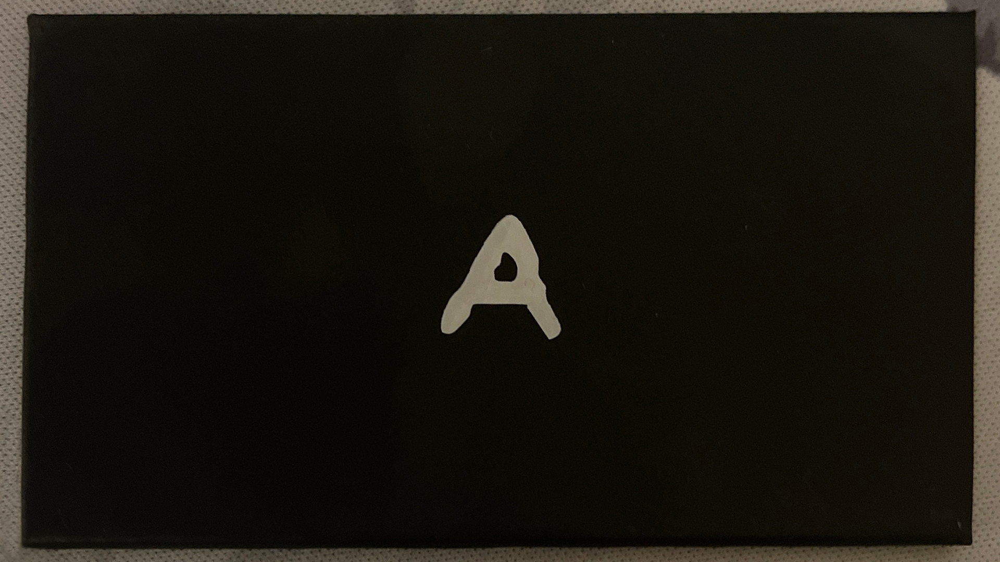

# Acquired symbols

This file show the symbols found for the dbrand Complete the Code 2 challenge.

[Join the madness and complete the code](https://discord.gg/dbrand)

**Note some cards have placeholders in place until a suitable image is found**

| Decoded Letter | Card |
| :---: | :---: |
| A |  |
| C |  |
| D |   | 
| E |     |
| H |  |
| O |    |
| R |  |
| S |  |
| T |    |
| W |  |
